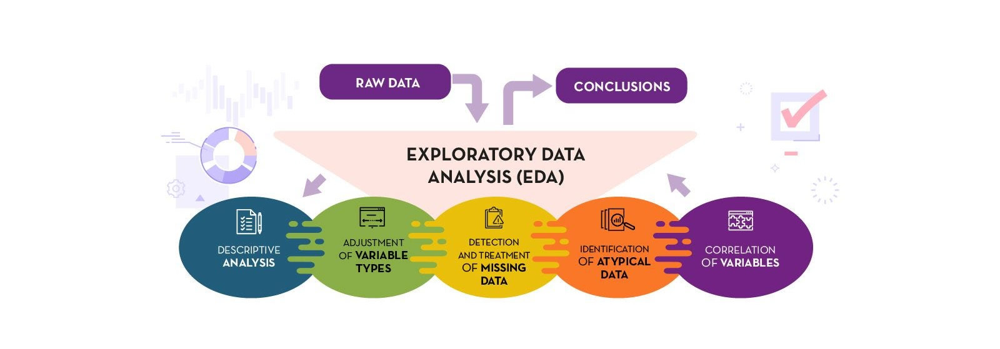

# Projetos de Data Science com Python 🐍

## 🔣 Limpeza e Pré-Processamento de Dados Complexos com NumPy [🔗 Acessar](Limpeza_Dados_Numpy/Limpeza-Numpy.ipynb)  

Neste projeto, desenvolvi uma solução para um cenário desafiador de Ciência de Dados. Imagine receber um dataset extremamente complicado:  
- Dados repletos de strings e caracteres especiais.  
- Problemas de encoding que tornam a leitura difícil.  
- Colunas com datas mal formatadas e valores numéricos misturados com textos.  
- URL’s contendo IDs críticos para a análise.  
- Valores ausentes e colunas com informações que deveriam estar distribuídas em três ou mais colunas.  

E, para complicar ainda mais, parte dos dados essenciais para a análise está em outro dataset, que precisa ser combinado com o primeiro. O objetivo principal foi limpar e pré-processar esses datasets, tornando-os prontos para análise. Tudo isso foi feito utilizando apenas NumPy, um pacote poderoso da linguagem Python, conhecido por suas capacidades de computação e processamento de dados.  

Neste projeto, enfrento desafios comuns em projetos reais e demonstro como superar esses obstáculos utilizando técnicas de manipulação de dados com NumPy. O resultado é um pipeline eficiente para preparar dados complexos para a sequência do processo de análise.

 
## 🐼 Análise de Dados Escolares com Pandas [🔗 Acessar](Dados_Escolares_Pandas/Dados_Escolares_Pandas.ipynb)  

Neste projeto, explorei questões importantes relacionadas à performance escolar, utilizando Ciência de Dados para investigar e responder perguntas como:  
1. Há diferença na performance escolar entre alunos de escolas públicas e particulares?  
2. O que diferencia as escolas que formam alunos de alta performance?  
3. Escolas (públicas ou particulares) com orçamentos mais altos têm alunos com melhores resultados nos testes de Matemática e Redação?  
4. O tamanho da escola (pequeno, médio ou grande porte) influencia na performance escolar dos alunos?  
5. Em qual tipo de escola (pública ou particular) há maior índice de aprovação?  

Para essa análise, utilizei o Pandas, uma das mais poderosas ferramentas de manipulação de dados da linguagem Python. Este projeto demonstra como explorar e interpretar dados educacionais para gerar insights significativos e responder a questões relevantes sobre o impacto de fatores como tipo de escola, orçamento e tamanho no desempenho dos alunos.

 
## 🔎 Análise Exploratória de Dados no Contexto de E-Commerce Analytics [🔗 Acessar](Analise_Exp_Ecommerce/Analise_Explo_Ecommerce.ipynb)  

Neste projeto, desenvolvi habilidades fundamentais em uma das etapas mais importantes da Ciência de Dados: a Análise Exploratória. O trabalho foi dividido em duas partes principais:  

__Parte 1: Detalhes Técnicos da Análise Exploratória__
- Realizei análises estatísticas detalhadas.  
- Construi visualizações de dados para interpretar padrões e tendências.  
- Analisei gráficos e tabelas com foco em insights relevantes.  
- Apliquei técnicas de análise univariada e bivariada.  
- Elaborei um relatório final consolidando as descobertas.  

__Parte 2: Análise Exploratória Orientada a Perguntas de Negócio__
- Manipulei os dados utilizando Data Wrangling com o Pandas.  
- Respondi perguntas específicas relacionadas ao negócio.  
- Analisei os dados sob diferentes perspectivas para identificar oportunidades e desafios.  
- Apliquei customização de gráficos para uma comunicação visual mais clara e eficaz.  

Todo o projeto foi realizado no contexto de um problema real de E-Commerce Analytics, simulando situações práticas em que a análise de dados é usada para tomada de decisões estratégicas.  

 
## 📐 Aplicação de Engenharia de Atributos em Dados de E-Commerce [🔗 Acessar](Eng_Atributos_Ecommerce/Engenharia_Atrib.ipynb)  
  
Neste projeto, desenvolvi técnicas de Engenharia de Atributos para analisar dados sob diferentes perspectivas e criar variáveis que auxiliem na compreensão da variável-alvo: identificar se um produto será enviado com atraso ou não.  

__Contexto do Problema:__ O cenário envolve uma empresa internacional de E-commerce que vende produtos eletrônicos.

__As operações incluem:__
- Produtos armazenados em um armazém na sede da empresa.
- Entregas realizadas por navio, avião ou caminhão, dependendo da região do cliente.
- Descontos oferecidos com base no peso dos produtos.
- Atendimento ao cliente por meio de chamadas ao suporte.
- Avaliações dos clientes sobre a experiência de compra após a entrega.
- O único dado pessoal disponível é o gênero do cliente.

__Objetivo:__ O foco foi criar novas variáveis a partir dos dados disponíveis, permitindo análises mais detalhadas e simplificadas que ajudem a entender fatores que influenciam atrasos nas entregas.

__Dados e Métodos:__ Utilizei um conjunto de dados fictício, representando informações reais de operações de e-commerce.

__Criei variáveis que exploram:__  
- O impacto do método de entrega no atraso.
- A relação entre descontos e a probabilidade de atraso.
- O comportamento dos clientes com base em gênero, chamadas ao suporte e avaliações de compra.
- O trabalho demonstra como a Engenharia de Atributos pode transformar dados brutos em informações mais significativas para modelagem e tomada de decisão.

 
## ⚙️ Pré-processamento de Dados para E-Commerce Analytics [🔗 Acessar](Process_Dados_Ecommerce/Pre_Processamento.ipynb)  
  

Neste projeto, apliquei técnicas de pré-processamento de dados para preparar um conjunto de dados voltado à modelagem preditiva no contexto de E-Commerce Analytics.

__Contexto do Problema__  
A análise foca em uma empresa internacional de comércio eletrônico que:  
- Armazena produtos em um armazém central e realiza entregas globais por navio, avião ou caminhão.
- Oferece descontos com base no peso dos produtos comprados.
- Possui suporte ao cliente para dúvidas e problemas durante o processo de compra.
- Coleta avaliações de clientes sobre a experiência de compra.
- Disponibiliza informações sobre o gênero dos clientes como dado pessoal único.

_O conjunto de dados utilizado foi enriquecido previamente com novas variáveis criadas durante a fase de Engenharia de Atributos (item anterior)._

__Pré-processamento de variáveis categóricas:__
- Aplicação de Label Encoding e One-Hot Encoding para transformar dados categóricos em formatos adequados para algoritmos de aprendizado de máquina.
- Feature Scaling de variáveis numéricas: Utilização de técnicas de Normalização e Padronização para garantir que os valores estejam em escalas apropriadas, otimizando o desempenho do modelo.

Embora a etapa de modelagem preditiva não seja abordada neste trabalho, o projeto foca na preparação dos dados, uma fase crítica para garantir a qualidade e eficácia da análise posterior.

 
## 🩸 Modelo de Machine Learning: O paciente vai ou não desenvolver uma doença hepática? (Classificação) [🔗 Acessar](MLClassificacao_Doenca_Hepatica/Classificacao-Doenca-Hepatica.ipynb) 
 
Neste mini-projeto, desenvolvi um modelo de Machine Learning para prever se um paciente desenvolverá ou não uma doença hepática, utilizando diversas características do próprio paciente. A ideia é que esse modelo possa ser uma ferramenta útil para médicos, hospitais ou governos, auxiliando no planejamento de gastos com saúde ou na criação de políticas de prevenção mais eficazes.  

Por se tratar de uma tarefa de previsão de classe (sim ou não), optei por usar aprendizado supervisionado para classificação. Durante o projeto, criei diferentes versões do modelo empregando diversos algoritmos de classificação, buscando identificar qual deles teria o melhor desempenho. O processo envolveu todas as etapas de Machine Learning, desde a pré-processamento de dados até a avaliação do modelo final.  

Os dados utilizados para treinar e testar o modelo foram obtidos a partir de um dataset público, disponível no seguinte link: [🔗 Dataset Utilizado](https://archive.ics.uci.edu/dataset/225/ilpd+indian+liver+patient+dataset)

Trabalhei cuidadosamente para garantir a integridade dos dados e realizar uma análise detalhada, ajustando o modelo para oferecer previsões confiáveis que possam contribuir para a tomada de decisões.

 
## 💸 Modelo de Machine Learning: Estratégias Baseadas em Dados para Melhorar Vendas no E-commerce (Regressão) [🔗 Acessar](https://github.com/gabrielpito92/data_science_python/blob/main/MLAnalise_Ecomerce/Vendas_Ecommerce.ipynb)  
 
Uma empresa de e-commerce comercializa produtos tanto por meio de um site quanto de um aplicativo móvel. Para cada cliente, a empresa registra o total gasto mensalmente, além do tempo que eles permanecem logados no sistema após cada login, seja no aplicativo ou no site.  

O desafio desse projeto foi ajudar a empresa (fictícia) a decidir em qual plataforma (site ou aplicativo) deveria focar seus investimentos para melhorar a experiência do usuário, aumentar o engajamento e, consequentemente, incrementar as vendas.  

[🔗 Dataset Utilizado](MLAnalise_Ecomerce/dados/dataset.csv)  

Com um orçamento limitado, a empresa só poderia investir em melhorias em uma das plataformas no momento.    

Utilizei um conjunto de dados fictício, que simula um mês de operações do portal e-commerce, mas que representa situações reais enfrentadas por empresas do setor. Esses dados incluíam informações como o tempo médio de login e o total de vendas por cliente em ambas as plataformas.  

Como parte do trabalho, realizei uma análise exploratória dos dados para identificar padrões de comportamento dos usuários e determinar qual plataforma apresentava maior potencial de retorno. Criei modelos preditivos para estimar o impacto de um possível aumento no tempo de login sobre o total de vendas. Por fim, apresentei um relatório com insights e recomendações baseados nos dados, orientando a empresa a direcionar os esforços para a plataforma que prometia maior engajamento e lucro futuro.  

Esse projeto demonstrou como a análise de dados pode orientar decisões estratégicas em negócios e como insights baseados em dados podem impulsionar os resultados de empresas em setores competitivos como o e-commerce.